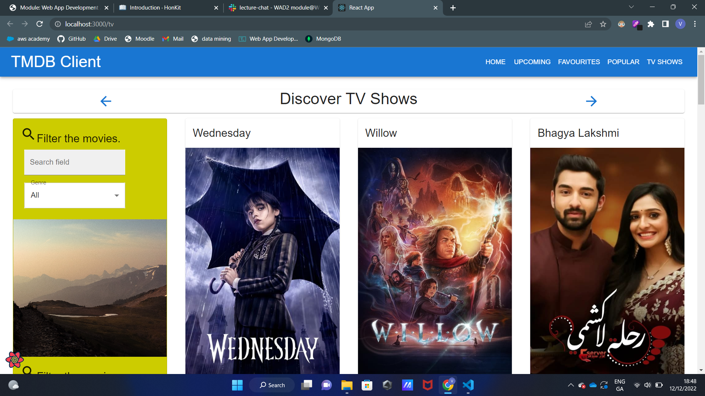

# Web App Dev 2 - Assignment 1 - ReactJS app.

Name: Vitor André Brochado Wogel da Costa

## Overview.

### New Pages.

+ List of most popular movies.
+ List of TV Series.
+ Details of each tv series.

## Setup requirements.

+ Install the node dependencies using the command: npm install
+ You will need to get a Movie database key (https://developers.themoviedb.org/4/getting-started/authorization), and store as an environment variable named 'REACT_APP_TMDB_KEY'.
+ Run the app with the command: npm start

## TMDB endpoints.

+ /movie/popular - A list for the most popular movies on TMDB.
+ /discover/tv - A list of the TV shows on TMBD. 
+ /tv/{tv_id} - The details for each tv show.

## App Design.

### UI Design.

>Shows a list of the most popular movies.

>Shows a list of the tv shows that are on the database.

>Shows the details of each tv series.

### Routing.

+ /movies/popular - A list for the most popular movies on TMDB.
+ /tv - A list of the TV shows on TMBD.
+ /tv/:id - The details for each tv show.
